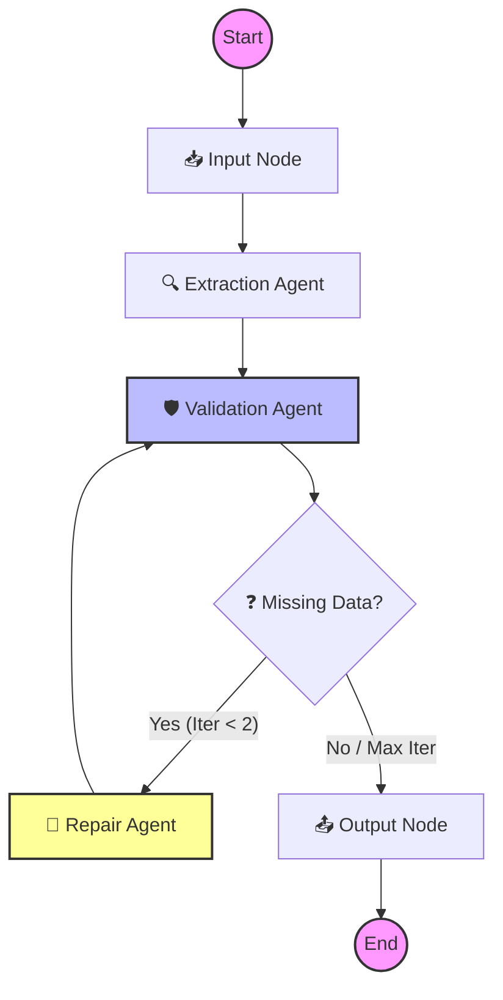

# 🧬 Extractor AI: LangGraph Structured Extraction

[](https://www.python.org/downloads/)
[](https://github.com/langchain-ai/langgraph)
[](https://deepmind.google/technologies/gemini/)
[](https://streamlit.io/)

**Extractor AI** is a robust, multi-agentic system designed to transform unstructured text into validated, high-fidelity structured data. Built on **LangGraph**, it employs a self-correcting workflow that doesn't just extract data but validates and repairs it through iterative feedback loops.

---

## 🧠 Application Logic: The Agentic Workflow

Unlike traditional one-pass extraction scripts, this application uses a stateful graph to ensure data integrity.

### Workflow Visualization



### Core Agents & Nodes

1.  **📥 Input Node**: Prepares the global state, initializes the schema, and sets up the iteration counters.
2.  **🔍 Extraction Agent**: Uses Gemini to parse the raw text. It strictly follows the provided JSON schema, identifying entity relationships and attributes.
3.  **🛡️ Validation Agent**: Scans the extracted JSON for null values or missing keys against the required schema.
4.  **🔧 Repair Agent (The "Self-Healer")**: If fields are missing, this agent re-analyzes the source text specifically looking for the missing information, while preserving previously extracted data. It can run up to 2 iterations to ensure maximum recall.
5.  **📤 Output Node**: Normalizes the final dataset and converts it into a clean, presentation-ready Pandas DataFrame.

---

## 🚀 Quick Setup

### 1. Prerequisites
- Python 3.9+
- A Google Gemini API Key ([Get one here](https://aistudio.google.com/app/apikey))

### 2. Installation
```bash
# Clone the repository
# cd langgraph-structured-extractor

# Create and activate virtual environment
python -m venv .venv
# On Windows: .venv\Scripts\activate
# On Unix/macOS: source .venv/bin/activate

# Install dependencies
pip install -r requirements.txt
```

### 3. Configuration
Create a `.env` file in the root directory:
```env
GOOGLE_API_KEY=your_api_key_here
GEMINI_MODEL=gemini-3-flash-preview
```

---

## 🛠️ Usage

### 🖥️ Streamlit Dashboard (Recommended)
Experience the full power of the agentic workflow with a real-time visual interface.
```bash
streamlit run streamlit_app.py
```
*Features: Live agent logs, dynamic schema editor, and interactive tables.*

### ⌨️ CLI Entry Point
For a quick programmatic test:
```bash
python main.py
```

---

## 📂 Project Architecture

```text
├── app/
│   ├── graph/          # Workflow orchestration (State & Builder)
│   ├── nodes/          # Individual agent logic (Extract, Validate, Repair)
│   ├── llm/            # Gemini client configuration
│   └── utils/          # Parsing & formatting utilities
├── streamlit_app.py    # Premium Web UI
├── main.py             # CLI Proof of Concept
└── requirements.txt    # Project dependencies
```

---

## 🌟 Why LangGraph?
By using a directed graph for extraction, we gain:
- **Resilience**: The system can recover from hallucinations or partial extractions.
- **Traceability**: Every step of the extraction is logged and can be inspected.
- **Modularity**: New validation rules or specialized "Expert Agents" can be added as new nodes easily.

---
<p align="center">Built with ❤️ using LangGraph and Google Gemini</p>
